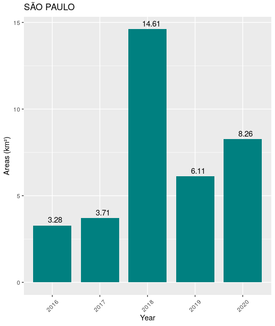

# R Client Terrabrasilis Analytics API

**terrabrasilisAnalyticsAPI** is an R client package for Terrabrasilis Analytics API. 

## Getting started

Installing and loading terrabrasilisAnalyticsAPI package in R

``` r
devtools::install_github("terrabrasilis/terrabrasilisAnalyticsAPI") # github group name is terrabrasilis
library(terrabrasilisAnalyticsAPI) # R package name is terrabrasilisAnalyticsAPI
```

Initialize Terrabrasilis Analytics API path variable

``` r 
apiPath <- "http://terrabrasilis.dpi.inpe.br/dashboard/api/v1/redis-cli/"
```

Define calls for application identifiers listing. From that information, it is possible then to make specific requests to other API end-points.

``` r
appIdentifier <- list_datasets(apiPath)

appIdentifier
[1] "prodes_cerrado"      "prodes_amazon"       "prodes_legal_amazon"
```

With that in mind, let's create a prodesCerrado variable.

``` r
prodesCerrado <- appIdentifier[1]

prodesCerrado
[1] "prodes_cerrado"
```

The first question that reminds us to ask to the API is: which periods do Prodes Cerrado contains?

``` r
periods <- list_periods(apiPath, prodesCerrado)

periods
```

``` r
periods
# A tibble: 15 x 6
   startDate.year startDate.month startDate.day endDate.year endDate.month endDate.day
            <int>           <int>         <int>        <int>         <int>       <int>
 1           2000               8             1         2002             7          31
 2           2002               8             1         2004             7          31
 3           2004               8             1         2006             7          31
 4           2006               8             1         2008             7          31
 5           2008               8             1         2010             7          31
 6           2010               8             1         2012             7          31
 7           2012               8             1         2013             7          31
 8           2013               8             1         2014             7          31
 9           2014               8             1         2015             7          31
10           2015               8             1         2016             7          31
11           2016               8             1         2017             7          31
12           2017               8             1         2018             7          31
13           2018               8             1         2019             7          31
14           1987               8             1         2000             7          31
15           2019               8             1         2020             7          31
```

Users can also ask to the API, for example, which classes do PRODES Cerrado contains?

```r
classes <- list_classes(apiPath, prodesCerrado)

classes
```

In this case, it is just one class designating deforestation label. Other thematic mapping projects, however, would contain more than one class or even the same class name.

```r
# A tibble: 1 x 3
     id name          description                                                         
  <int> <chr>         <chr>                                                               
1     1 deforestation It is the process of complete and permanent disappearance of forests
```

Besides responding which classes and periods, users might ask which local of interests (lois) as states, municipalities, conservation units, indigeneous areas, and Landsat Path/Row, the API provides. 

```r
locals <- list_locals(apiPath, prodesCerrado)

locals
```

```r
# A tibble: 4 x 2
    gid name    
  <int> <chr>   
1     1 uf      
2     2 mun     
3     3 consunit
4     4 indi    
```

Nevertheless, locals are not considered the final granularity since each state, municipality, conservation unit, indigeneous areas, and Landsat Path/Row also contain small-scale local of interests.

```r
localOfInterest <- list_local_of_interests(apiPath, prodesCerrado)

localOfInterest[402:412,]
```

```r
# A tibble: 11 x 4
     gid loiname                            codibge   loi
   <int> <chr>                                <int> <dbl>
 1  2850 CRIXÁS_GOIÁS                       5206404     2
 2  2468 ADELÂNDIA_GOIÁS                    5200159     2
 3  1798 DOIS IRMÃOS DO TOCANTINS_TOCANTINS 1707207     2
 4  2429 SANTA LÚCIA_SÃO PAULO              3546900     2
 5  1489 PONTO CHIQUE_MINAS GERAIS          3152131     2
 6  2335 ASSIS_SÃO PAULO                    3504008     2
 7  1989 ROMARIA_MINAS GERAIS               3156403     2
 8  1560 SERRA DO SALITRE_MINAS GERAIS      3166808     2
 9  1587 CAMPOS NOVOS PAULISTA_SÃO PAULO    3509809     2
10  2574 PROFESSOR JAMIL_GOIÁS              5218391     2
11  1898 SANTA RITA_MARANHÃO                2110203     2
```

Users are able to filter loinames by one specific loi such as UF.

```r
loiUF = dplyr::filter(locals, grepl("uf", name))$gid

loinamesByLoi <- list_localOfInterestByLocal(apiPath, prodesCerrado, loiUF)

loinamesByLoi
```

```r
# A tibble: 13 x 2
     gid loiname           
   <int> <chr>             
 1  1185 BAHIA             
 2  1186 DISTRITO FEDERAL  
 3  1187 GOIÁS             
 4  1188 MARANHÃO          
 5  1189 MATO GROSSO       
 6  1190 MATO GROSSO DO SUL
 7  1191 MINAS GERAIS      
 8  1192 PARÁ              
 9  1193 PIAUÍ             
10  1194 SÃO PAULO         
11  1195 TOCANTINS         
12  1196 PARANÁ            
13  1197 RONDÔNIA       
```

In order to fit data into governmental needs, we also considered filters for each data recognized that as type in the data API call.

```r
filters <- list_filters(apiPath, prodesCerrado)

filters
```

```r
# A tibble: 2 x 2
     id type              
  <int> <chr>             
1     1 fid_area >= 0.0625
2     2 fid_area >= 0.01
```

All this data is used to gather specific thematic map area values produced by government agencies such as the National Institute for Space Research. In this example, users are able to acquire data by loiname, that is, the function accepts as parameters, the class name and loiname gid as well.

```r
data <- get_dataByLocalOfInterest(apiPath, 
                                  prodesCerrado, 
                                  classes$name, 
                                  loinamesByLoi[1,]$gid)

data
```

```r
             name         clazz startDate.year startDate.month startDate.day endDate.year endDate.month endDate.day loi loiname type       area
1  PRODES CERRADO deforestation           2000               8             1         2002             7          31   1    1185    1  4308.7598
2  PRODES CERRADO deforestation           2000               8             1         2002             7          31   1    1185    2  4570.1642
3  PRODES CERRADO deforestation           2002               8             1         2004             7          31   1    1185    1  5075.4283
4  PRODES CERRADO deforestation           2002               8             1         2004             7          31   1    1185    2  5400.1104
5  PRODES CERRADO deforestation           2004               8             1         2006             7          31   1    1185    1  3305.8449
6  PRODES CERRADO deforestation           2004               8             1         2006             7          31   1    1185    2  3599.6725
7  PRODES CERRADO deforestation           2006               8             1         2008             7          31   1    1185    1  3635.5140
8  PRODES CERRADO deforestation           2006               8             1         2008             7          31   1    1185    2  4020.0215
9  PRODES CERRADO deforestation           2008               8             1         2010             7          31   1    1185    1  2177.6916
10 PRODES CERRADO deforestation           2008               8             1         2010             7          31   1    1185    2  2417.5602
11 PRODES CERRADO deforestation           2010               8             1         2012             7          31   1    1185    1  2922.7548
12 PRODES CERRADO deforestation           2010               8             1         2012             7          31   1    1185    2  3047.2696
13 PRODES CERRADO deforestation           2012               8             1         2013             7          31   1    1185    1  1330.3253
14 PRODES CERRADO deforestation           2012               8             1         2013             7          31   1    1185    2  1562.1050
15 PRODES CERRADO deforestation           2013               8             1         2014             7          31   1    1185    1   972.4348
16 PRODES CERRADO deforestation           2013               8             1         2014             7          31   1    1185    2  1078.8954
17 PRODES CERRADO deforestation           2014               8             1         2015             7          31   1    1185    1  1205.3126
18 PRODES CERRADO deforestation           2014               8             1         2015             7          31   1    1185    2  1334.5169
19 PRODES CERRADO deforestation           2015               8             1         2016             7          31   1    1185    1   714.1984
20 PRODES CERRADO deforestation           2015               8             1         2016             7          31   1    1185    2   782.1150
21 PRODES CERRADO deforestation           2016               8             1         2017             7          31   1    1185    1   728.0815
22 PRODES CERRADO deforestation           2016               8             1         2017             7          31   1    1185    2   783.0249
23 PRODES CERRADO deforestation           2017               8             1         2018             7          31   1    1185    1   646.8232
24 PRODES CERRADO deforestation           2017               8             1         2018             7          31   1    1185    2   696.9687
25 PRODES CERRADO deforestation           2018               8             1         2019             7          31   1    1185    1   780.0096
26 PRODES CERRADO deforestation           2018               8             1         2019             7          31   1    1185    2   832.3697
27 PRODES CERRADO deforestation           1987               8             1         2000             7          31   1    1185    1 29577.0078
28 PRODES CERRADO deforestation           1987               8             1         2000             7          31   1    1185    2 29781.4093
29 PRODES CERRADO deforestation           2019               8             1         2020             7          31   1    1185    1   834.6321
30 PRODES CERRADO deforestation           2019               8             1         2020             7          31   1    1185    2   919.1458
```

The same query can be performed using get data by parameters function. In this case, users pass also as parameters a start and end date. Unlikely the previous call, users will not receive all the available timeline as soon as they really desire.

```r
data <- get_dataByParameters(apiPath, 
                            prodesCerrado, 
                            classes$name, 
                            loinamesByLoi[1,]$gid, 
                            "2015-01-01", 
                            "2021-01-01")

data
```

```r
              name         clazz startDate.year startDate.month startDate.day endDate.year endDate.month endDate.day loi loiname type     area
1  PRODES CERRADO deforestation           2015               8             1         2016             7          31   1    1185    1 714.1984
2  PRODES CERRADO deforestation           2015               8             1         2016             7          31   1    1185    2 782.1150
3  PRODES CERRADO deforestation           2016               8             1         2017             7          31   1    1185    1 728.0815
4  PRODES CERRADO deforestation           2016               8             1         2017             7          31   1    1185    2 783.0249
5  PRODES CERRADO deforestation           2017               8             1         2018             7          31   1    1185    1 646.8232
6  PRODES CERRADO deforestation           2017               8             1         2018             7          31   1    1185    2 696.9687
7  PRODES CERRADO deforestation           2018               8             1         2019             7          31   1    1185    1 780.0096
8  PRODES CERRADO deforestation           2018               8             1         2019             7          31   1    1185    2 832.3697
9  PRODES CERRADO deforestation           2019               8             1         2020             7          31   1    1185    1 834.6321
10 PRODES CERRADO deforestation           2019               8             1         2020             7          31   1    1185    2 919.1458
``` 


In this example, users are able to acquire data by loiname (SÃO PAULO) and dates, we also considered filters in the data. 
Compare with SÃO PAULO http://www.terrabrasilis.dpi.inpe.br/app/dashboard/deforestation/biomes/cerrado/increments
```r
data <- get_dataByParameters(apiPath, prodesCerrado, classes$name, loinamesByLoi[10,]$gid, "2015-01-01", "2020-12-31") %>% 
  dplyr::filter(.,type==2) %>% 
  dplyr::filter(.,endDate.year!=2000) %>% 
  dplyr::select(name, clazz, startDate.year, endDate.year, area)

data
```

```r
            name         clazz startDate.year endDate.year      area
1 PRODES CERRADO deforestation           2015         2016  3.275794
2 PRODES CERRADO deforestation           2016         2017  3.706419
3 PRODES CERRADO deforestation           2017         2018 14.607230
4 PRODES CERRADO deforestation           2018         2019  6.113063
5 PRODES CERRADO deforestation           2019         2020  8.259873
```

Plot result
```r
library(ggplot2) 

ggplot(data, aes(x=as.factor(endDate.year), y=area, fill=clazz)) + 
  geom_text(aes(label=as.numeric(round(data$area, 2))), vjust=-0.5, hjust=0.3, size = 4) +
  geom_bar(stat = "identity", width = 0.8, fill = "#008080") +
  scale_x_discrete("Year", labels = as.character(data$endDate.year), breaks = data$endDate.year) +
  theme(axis.text.x = element_text(angle = 45, vjust = 0.5)) +
  labs(colour = "Date") + labs(x = "Years") + labs(y = "Areas (km²)") + 
  labs(title = loinamesByLoi[10,]$loiname) + labs(fill = "class")

```

<table width="700" border="0">
<tr>
<td align="center" valign="center">

<p class="caption">
Fig. 1. Deforestation increments - Cerrado biome, São Paulo State
</p>
</td>
</tr>
</table>


## References

Assis, L. F. F. G. A.; Ferreira, K. R.; Vinhas, L.; Maurano, L.; Almeida, C. A., Nascimento, J. R., Carvalho, A. F. A.; Camargo, C.; Maciel, A. M. TerraBrasilis: A Spatial Data Infrastructure for Disseminating Deforestation Data from Brazil. In Proceeding of the XIX Remote Sensing Brazilian Symposium, 2019.

## Reporting Bugs

Any problem should be reported to terrabrasilis@inpe.br.
